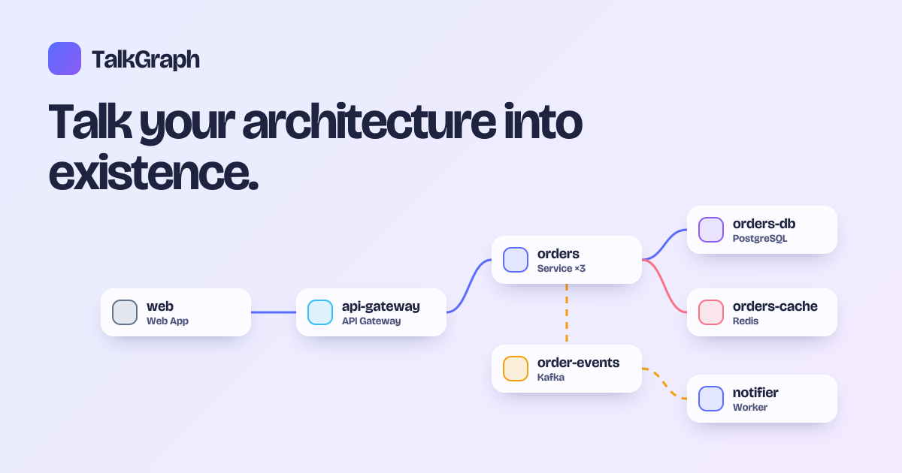
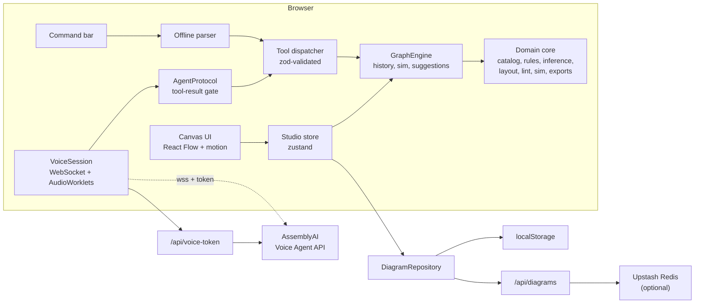

# TalkGraph

**Talk your architecture into existence.**

TalkGraph is a voice-controlled system architecture canvas. Describe a system out loud ("add a Postgres behind the API, put a queue between them") and the diagram builds and edits itself in place, animated, validated against real architecture rules, and ready to stress-test.



- **Voice first, never voice only.** Everything works by voice, by dragging from the component library, by clicking to edit, and by typing in the command bar (⌘K / Ctrl K).
- **Nothing is invented.** The agent edits the diagram only through a few strictly typed tools whose enums come from an allowlisted catalog of 42 components.
- **It pushes back.** Illegal connections (a browser talking straight to Postgres, a queue writing to a database, replication across engines) are rejected, explained out loud, and paired with a one-tap fix.
- **It infers sensible defaults.** Names ("orders-db"), protocols (gRPC, SQL, RESP), placement, and obvious wiring are inferred and badged, with a one-tap undo.
- **It's a model, not a picture.** A live linter flags single points of failure, missing caches and queues, and plaintext links. Traffic simulation and chaos mode show overloads and cascading failure; "fix it" applies validated remedies.
- **It ships.** Terraform skeleton, Mermaid, and an ADR, all generated from the same typed graph.
- **It's measured.** A benchmark of spoken scenarios is scored against the resulting graph: offline in CI, and live against the AssemblyAI Voice Agent.

Built for the [AssemblyAI Voice Agent Hackathon](https://lablab.ai/ai-hackathons/assemblyai-voice-agent-hackathon).

| Route | What |
| - | - |
| `/` | Landing page with a live demo running the real engine |
| `/app` | The canvas |
| `/bench` | Benchmark: offline parser and live voice agent |
| `/pitch` | Pitch deck (arrow keys; "Save as PDF" prints one slide per page) |

## How the voice agent works

TalkGraph uses the [AssemblyAI Voice Agent API](https://www.assemblyai.com/docs/voice-agents/voice-agent-api) directly from the browser:

1. **Server-minted token.** `GET /api/voice-token` calls `GET https://agents.assemblyai.com/v1/token` with the API key (which never leaves the server) and returns a single-use token with a 60-second redemption window. The route checks the request origin and rate-limits per IP.
2. **One WebSocket.** The browser opens `wss://agents.assemblyai.com/v1/ws?token=…` and sends one `session.update` with an inline configuration: system prompt, greeting, voice, tools, keyterms, and a transcription prompt. Audio starts only after `session.ready`.
3. **Audio.** Mic audio is captured at the device's native rate and resampled to 24 kHz PCM16 in an AudioWorklet (as AssemblyAI recommends for Firefox and Safari), sent in ~50 ms base64 chunks. Playback runs through a ring-buffer worklet that barge-in (`input.speech.started`) empties instantly.
4. **Few general tools with strict schemas.** Nine client-side tools (`add_components`, `connect_components`, `insert_between`, `update_component`, `update_connection`, `remove`, `simulate`, `review_architecture`, `canvas`) are each defined once as a strict zod schema. That schema validates arguments locally and is compiled to the JSON Schema sent to the API, so the two can't drift. Tool schemas are also validated locally at startup, since the API doesn't check them.
5. **Apply on `tool.call`, reply on `reply.done`.** Every `tool.call` is applied to the graph immediately, so the canvas animates while the agent is still talking. The `tool.result` is queued and sent only when `reply.done` is the latest event. Results are held on `reply.started` / `input.speech.started` and dropped on an interrupted `reply.done`, exactly as documented.
6. **The agent always sees the canvas.** After every edit (voice, mouse, or keyboard), a debounced `session.update` pushes a compact description of the live graph into `system_prompt` and refreshes `keyterms` with catalog jargon plus the user's own component names.
7. **Confirm only what's destructive.** Removing connected components, clearing, or replacing the canvas returns `needs_confirmation`; the agent asks a yes/no question and retries with `confirmed: true`. Ambiguous references ("the database" when there are two) come back as `ambiguous` with the candidates, so the agent asks only when it really has to.
8. **Clean shutdown.** Stopping sends `session.end` and waits for `session.ended`; `pagehide` sends `session.end` synchronously so closed tabs don't sit in the billable 30-second resume window.

Typed commands go through the live agent too when a session is open (`conversation.message` + `reply.create`); otherwise the offline parser handles them.

## Architecture



Every input path (voice, typing, drag and drop, one-tap fixes, simulation remedies) compiles to the same deterministic domain `Command`s, applied as atomic, undoable transactions. The domain core has no React or browser dependencies.

```
src/
  config/        product.ts (name, voice, greeting in one place), env.ts
  domain/        catalog, graph types, commands, rules, infer, apply (reducer),
                 resolve, layout, lint, sim, remedy, templates, export/{terraform,mermaid,adr}
  engine/        GraphEngine: graph + undo/redo + simulation + pending suggestion
  voice/         tools (zod schemas), dispatch, prompt, config, protocol, audio, session
  nlu/           offline parser + runner (command bar, CI benchmark)
  bench/         scenarios, runner, live driver
  storage/       DiagramRepository interface, local + remote implementations, Upstash client
  store/         zustand studio store
  components/    canvas (nodes, edges, view), studio (panels, dock, dialogs), landing, pitch, bench
  app/           routes and API handlers
tests/           domain, voice protocol, parser + offline benchmark, landing script
```

## Run locally

Requirements: Node 20.9+.

```bash
npm install
cp .env.example .env.local     # add ASSEMBLYAI_API_KEY to enable voice
npm run dev                    # http://localhost:3000
```

Without a key, everything except voice works: the command bar, drag and drop, the linter, simulation, exports, and the offline benchmark. The mic button explains how to turn voice on.

Use Chrome or Edge for the smoothest voice experience; Firefox and Safari are supported through in-worklet resampling. Voice needs HTTPS or `localhost`.

```bash
npm test            # unit tests + offline benchmark
npm run typecheck
npm run lint
npm run build
```

## Deploy to Vercel

1. Push the repo to GitHub and import it at [vercel.com/new](https://vercel.com/new). The framework preset is detected as Next.js; no build settings need changing.
2. Under **Settings → Environment Variables**, add `ASSEMBLYAI_API_KEY` (Production and Preview). Optionally set `NEXT_PUBLIC_SITE_URL` to your production URL.
3. Optional persistence: add **Upstash for Redis** from the Vercel Marketplace (it sets `KV_REST_API_URL` / `KV_REST_API_TOKEN`), or set `UPSTASH_REDIS_REST_URL` / `UPSTASH_REDIS_REST_TOKEN` yourself. Without it, diagrams persist in each visitor's browser.
4. Deploy. Check `https://<your-app>/api/health`: it should return `{"voice":true,...}`.

Or from the CLI:

```bash
npx vercel login
npx vercel link
npx vercel env add ASSEMBLYAI_API_KEY production
npx vercel --prod
```

Anyone with the URL can start voice sessions billed to your key. The token route rate-limits per IP (`VOICE_TOKENS_PER_MINUTE`) and caps session length (`VOICE_MAX_SESSION_SECONDS`); put real auth in front of it before a public launch.

## Configuration

| Variable | Default | Purpose |
| - | - | - |
| `ASSEMBLYAI_API_KEY` | none | Enables voice. Server-only. |
| `VOICE_MAX_SESSION_SECONDS` | `1800` | Session duration cap passed to the token endpoint. |
| `VOICE_TOKENS_PER_MINUTE` | `20` | Per-IP token mint limit. |
| `UPSTASH_REDIS_REST_URL` / `_TOKEN` | none | Server-side diagrams and version history. `KV_REST_API_*` also accepted. |
| `NEXT_PUBLIC_SITE_URL` | `https://talkgraph.vercel.app` | Metadata and links. |

To rename the product, change `src/config/product.ts`. The voice (`jane`) and greeting live there too.

## Extending

- **Add a component:** append an entry to `COMPONENTS` in `src/domain/catalog.ts` (kind, category, icon, aliases, capacity, keyterms). It flows automatically into the palette, tool enums, keyterms, parser, simulator, and exports; add a Terraform mapping in `src/domain/export/terraform.ts`.
- **Add a connection rule:** `categoryRule` in `src/domain/rules.ts`. Return a rejection with a sentence the agent can say and a `Suggestion` built from commands.
- **Add a linter rule:** `lintGraph` in `src/domain/lint.ts`. Give each finding a stable id, a spoken message, and optionally a fix as commands.
- **Add a benchmark scenario:** `SCENARIOS` in `src/bench/scenarios.ts`. It runs in CI immediately and live from `/bench`.

## Benchmark

`/bench` runs every scenario from a known starting canvas and checks the resulting typed graph (nodes, edges, link types, TLS, replicas, simulation health), never the agent's wording.

- **Offline** uses the deterministic parser and the same dispatcher. It runs in CI (`npm test`), and the landing page shows its live pass rate.
- **Live** opens a fresh AssemblyAI session per scenario, injects each spoken turn as a user message, and lets the real agent call the real tools. Pass rate and per-turn tool calls are shown for each scenario.

## Limits worth knowing

- The simulation is a deterministic flow model meant to make capacity and coupling visible, not a queueing-theory predictor.
- Terraform output is a skeleton for AWS: one resource per component and security-group rules from connections, with TODOs where real decisions are required.
- The token route's rate limiter is per serverless instance. Use a shared store for strict quotas.

## License

MIT. See [LICENSE](LICENSE). Brand icons from [simple-icons](https://simpleicons.org) (CC0); Bricolage Grotesque under the SIL Open Font License.
